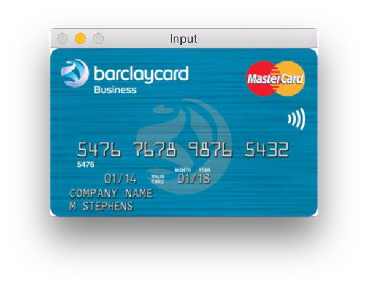
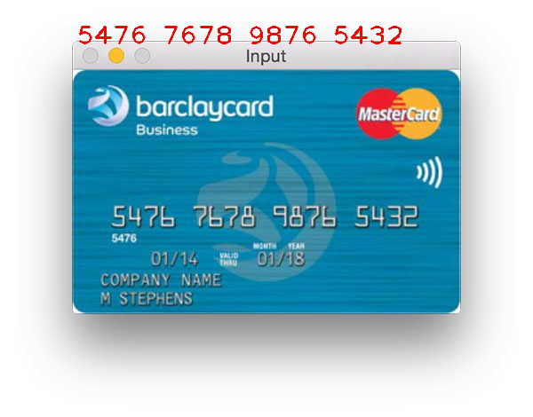

# CreditCardReader

This project reads an credit card image and reads the card number of the card.

Example input:

Output:

The idea is to use contour detection to find the contours of each digit. Then matching against a reference image:

OpenCV and C++ is used.